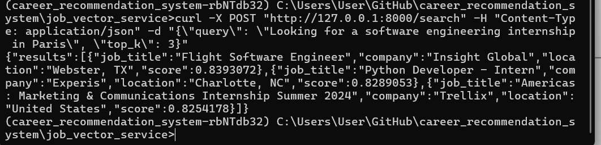

/notebook/vector_search_qdrant.ipynb:
this notebook contains explanations to the code and some testing on the df and the embeddings outputs. this file is later turned into a .py file.

/imgs:
screenshots from the qdrant GUI

/qdrant_storage:
folder generated by qdrant to store files (do not remove)

Pipfile and requirements.txt:
the necessary libraries in this virtual environment


Two endpoints:

    /store_jobs: Accepts new job postings and stores them in Qdrant.

    /search_jobs: Accepts a user query and returns top-matching job(s).


Notes:

You're very close! Since you're building a job recommendation system using Qdrant and FastAPI, here's how to send user queries and get matching job results.
🧠 How It Works

You built a /search endpoint that:

    Accepts a query from the user (e.g., "I'm looking for a remote software engineering role")

    Converts that query to an embedding vector using fastembed

    Searches your jobs-collection in Qdrant using this vector

    Returns the top job matches from your collection

🧪 Step-by-Step Example Using curl

Here’s a curl command to send a request to your API:

```
curl -X POST "http://127.0.0.1:8000/search" \
  -H "Content-Type: application/json" \
  -d '{"query": "Looking for a software engineering internship in Paris", "top_k": 3}'
````

```
curl -X POST "http://127.0.0.1:8000/search" -H "Content-Type: application/json" -d "{\"query\": \"Looking for a software engineering internship in Paris\", \"top_k\": 3}"

````


🧾 What Each Field Means
| Field   | Type    | Description                                                                     |
| ------- | ------- | ------------------------------------------------------------------------------- |
| `query` | string  | The user’s sentence describing what kind of job they are looking for            |
| `top_k` | integer | (Optional) How many job matches you want to return (default is 3 in your model) |


### Testing
1. search :

inside the virual environment (after running pipenv shell)
1. run the service in the terminal using : `uvicorn main:app --reload`

2. run a curl command :
curl -X POST "http://127.0.0.1:8000/search" -H "Content-Type: application/json" -d "{\"query\": \"Looking for a software engineering internship in Paris\", \"top_k\": 3}"
`
3. you see the output in the browser


